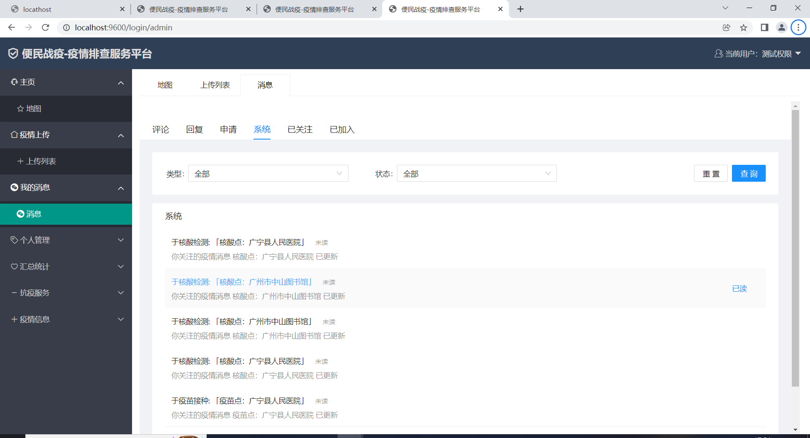
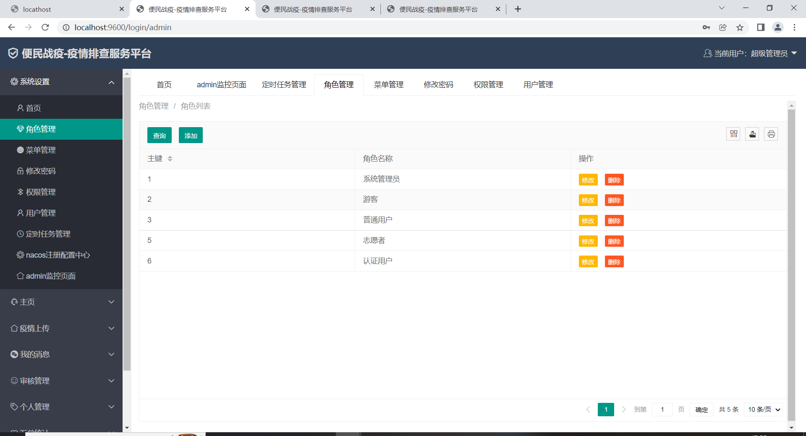
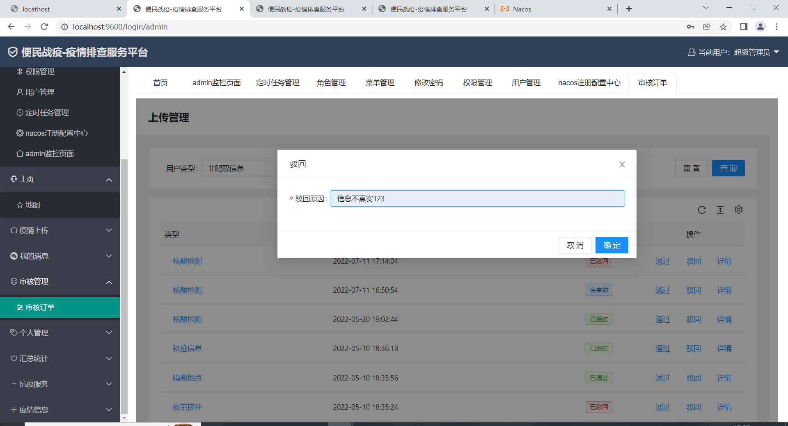

# 

# 便民战役—疫情排查服务平台

## 一、项目实施的目的、意义  

 

全球疫情进入常态化防控，在一定程度上制约着人们的出行需求与日常生活。由于疫情反复，居民苦于疫情久矣。为了出行平安，不仅需要查寻各地防疫政策，提前进行核酸检测，还需要注意避开中高风险地区和确诊人员轨迹等，也要随时随地掏出手机，各种扫码，常常会因为不知道哪个功能在哪个应用而苦恼。

因此，能够准确快速了解到较为详细的相关疫情防控信息，成为人们的迫切需求。基于这一需求和针对疫情信息传播不够方便，也不够直观展示等一系列痛点，该项目《便民战役-疫情排查服务平台》应用而生。

我们从全方面疫情防控入手，为广大居民提供最便利，最快捷的疫情排查服务，为疫情防控人员与普通群众之间提供信息桥梁。使群众快速的查看可进行核酸检测，疫苗接种，隔离地点，阳性轨迹等信息，并清淅准确的展示在地图上，以最简单明了的方式，为大家提供服务，同样还含有疫情资讯，大数据行程卡等出行工具。

  我们集成几乎市面上所有的疫情排查工具，核心主旨就是，便捷，清淅和准确。是以防控疫情为目的的“集大成之作”。

本项目为抗疫公益项目，注册用户使用完全免费，参加政府招商项目，力争与政府推广合作。以极少的成本运营，维护，主要服务大众、服务人民，服务国家，为战胜疫情而贡献自己的一份力量。

## 二、技术栈

SpringCloud+ MyBatis+Shiro+Redis+Nacos+Hystrix+Async+Quartz+Jsuop+React+Layui

本平台基于react+umi库与springcloud+springboot+mybatis+shiro+redis+async并结合定时任务框架的前后端分离的web分布式项目，react的使用使得各类响应速度更快，且跨浏览器兼容性更好，使得部署到服务器的平台，不仅可以电脑端浏览，也可手机端浏览；而springboot+redis+async的使用，简化了项目的配置，方便与前端进行数据交互，项目的框架更加稳定与健壮，整体提升了项目的性能，定时任务框架结合爬虫程序，定时上传更新相关数据信息，保证相关信息的时效性，基于项目的分布式开发，本项目使用了Nacos注册中心对分布式的各个微服务进行服务管理，及使用feign与进行服务与服务之间的通信，使得整体的分布式的服务之间的相互通信以及相互调用变得更加紧密，符合三高要求；

用于本项目是一个分布式项目，因此每个服务的url请求是不一样的，因此加入了springboot的admi监控以及springcloud的gateway网关，进行负载均衡与反向代理，本项目采用随机分配策略当调度服务器收到用户请求后，可以随机决定使用哪台后端服务器，然后将该服务器的IP封装在HTTP响应消息的Location属性中，返回给浏览器即可。以及轮询策略(RR) 调度服务器需要维护一个值，用于记录上次分配的后端服务器的IP。那么当新的请求到来时，调度者将请求依次分配给下一台服务器。保证请求能命中的同时实现负载均衡，

本项目还采用了熔断降级机制，熔断机制一般是某个服务故障或者是异常引起的，类似现实世界中的‘保险丝’，当某个异常条件被触发，直接熔断整个服务，而不是一直等到此服务超时，为了防止防止整个系统的故障，而采用了一些保护措施。过载保护。比如A服务的X功能依赖B服务的某个接口，当B服务接口响应很慢时，A服务X功能的响应也会被拖慢，进一步导致了A服务的线程都卡在了X功能上，A服务的其它功能也会卡主或拖慢。此时就需要熔断机制，即A服务不在请求B这个接口，而可以直接进行降级处理。降级处理，服务器当压力剧增的时候，根据当前业务情况及流量，对一些服务和页面进行有策略的降级。以此缓解服务器资源的的压力，以保证核心业务的正常运行，同时也保持了客户和大部分客户的得到正确的响应。

Nacos注册中心，feign服务通信，admi监控，gateway网关，nginx负载均衡器，保证服务间的稳定通信以及参数传递，平衡负载以及稳定使用，是整个项目达到高可用，高可靠，高并发要求，提升用户体验感。

## 三、安装使用

本项目是基于BS模式开发模式的web应用，最终项目将会部署到网络服务器，无需安装，用户可以通过特定的URL访问并使用该平台；

本地部署（试运行），平台底层使用Springboot+mybatis开发，解压项目压缩包，并且导入相关试运行数据库文件，修改mybatis的配置信息，由于springboot内部嵌套了Tomcat本地服务器，因此配置好持久层，在idae上运行springboot启动后端服务器，在 VScode启动前端服务器react，即可在地址栏输入http://localhost8083/index即可访问试运行版本,可以无需登录的游客模式访问，也可以用管理员身份:用户名admin,密码123456，进行登录也可以用普通用户身份，用户名：test，密码：12345，进行登录访问。

前端react部分地址：

 github : https://github.com/liyongchun01/ep-webapp/tree/master/ep-webapp

后端SpringBoot单体版地址 ：

gitee: https://gitee.com/iia_ljh/springboot

 github :https://github.com/iia0326/springboot---.git

后端SpringCloud升级版地址：

gitee: https://gitee.com/iia_ljh/springcloud

 github : https://github.com/iia0326/springcloud---.git

2022年8月1日前可访问游客模式、可普通用户test，12345

访问部署线上的地址http://114.55.109.210:8083/index

## 四、本项目若商业化必须与我们联系

### 注意事项

1、本项目已获中国大学生计算机设计比赛国赛3等奖、及互联网+创新创业比赛黑龙江省铜奖、已经申请软件专利。

2、开源供大家学习交流、及完善此公益项目

3、开发人员：林家豪、李永淳、张灏

## 五、适用场景

**本平台的使用场景主要面向2个群体使用，普通用户和疫情防控人员，有三种使用场景**

第一个场景，普通用户可以在地图上面看到所在位置的附近，哪里可以做核酸、接种疫苗，等待人数较少，哪里是隔离地点、封控地区。可以快速的了解到防疫信息的工作时间，具体地址，疫苗批次，疫苗公司，联系电话，隔离人数等信息，用户可以通过地图上标记和博客下的交流信息，得到一个参考，可以更快更好的做选择，提高人民出行效率，并且使防疫工作的负载得到了均衡。

 

第二个场景，普通用户使用轨迹排查，可以在地图上快速的检索什么时间段、什么地点内是否有确诊人员的轨迹，方便用户自行判断是否与轨迹重合。

 

第三个场景，疫情防控人员可以由一个人创建疫情信息，多人申请加入，在创建者同意后，可以共同管理这条疫情信息，例如及时的更新当前等待人数，并且在疫情博客页面，以楼主 的身份去回应用户所反馈的信息和问题。

## 六、特色设计，（疫情地图和疫情博客）

特色设计主要是疫情地图和疫情博客，分5个方面，从信息的真实性，信息的及时性，信息的交流，信息维护管理。信息的查看这5个方面去讲解，

在疫情地图里面。前三个核酸疫苗隔离，主要是为了给疫情工作人员与普通用户之间提供一个信息交流平台，由疫情防控人员创建，普通用户进行浏览观看。

 

第一，为了保证信息的真实性，在创建的时候，我们采用了人工审核的方式，只有通过审核的信息才能展示出来。审核管理，可以按类型，时间，用户进行检索的功能，驳回需要填写原因，保证了信息的真实性。

 

第二，为了保证信息的及时可靠性，我们在轨迹模块里使用定时任务，在阿里旗下的夸克搜索引擎里，定时获取轨迹信息，更新到数据库，以避免了用户上传的繁琐，由于地图上轨迹信息较多，我们采用了地图聚集的方法来更加直观展示。

 

第三，为了方便用户与疫情防控人员的信息交流。我们开发了疫情博客功能，在博客里我们可以看到具体的疫情信息。并且可以评论、回复、关注、加入

 

第四，为了方便信息的维护管理。这里信息维护是多人管理、共同编辑的意思，就像刚才讲解的使用场景，一人创建，多人申请加入，实现共同管理、维护。

 

第五，为了方便信息的查看。我们开发了我的信息模块，在评论里，看可以到别人在我所管理的博客下面的所有评论，在回复里，可以看到别人在某篇博客里面所回复我的信息，在系统里，可以看到我所关注的博客的信息更新之后系统所给的提示，并且可以把信息设置为已读。在申请这里，可以看到我发出去的信息，和别人所发给自己的申请，并且每一个都可以进行类型的筛选，比如核酸、疫苗、隔离、轨迹，还有已读和未读状态的筛选。

## 七、流程图

## 八、运行截图

### 游客

### 用户

### 管理员

